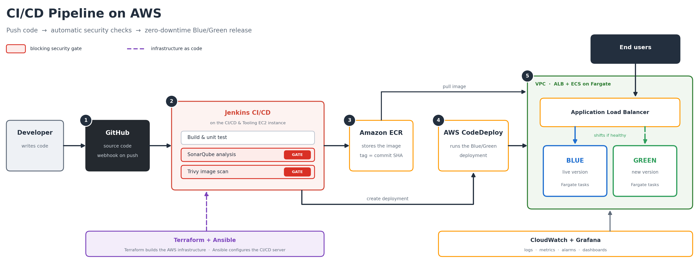
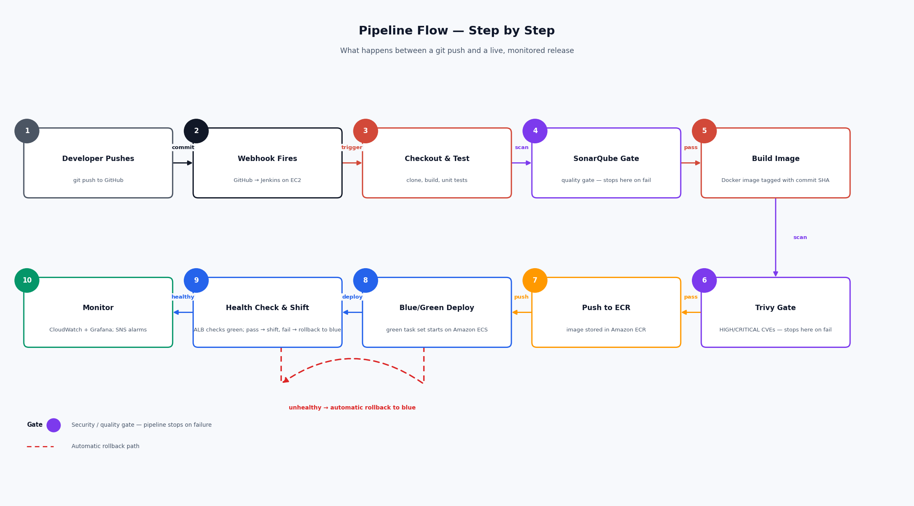
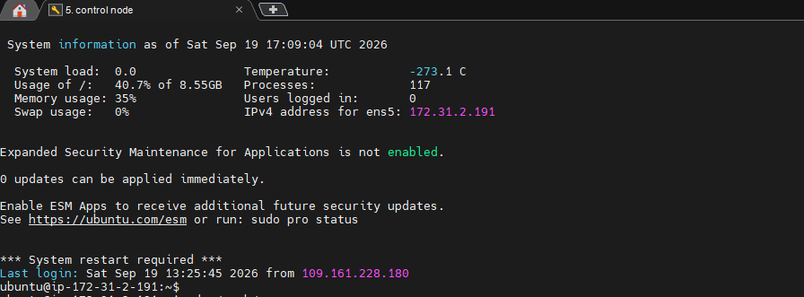
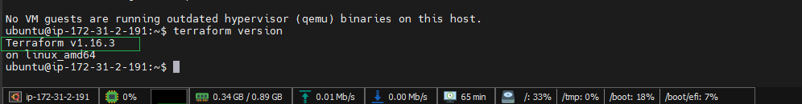
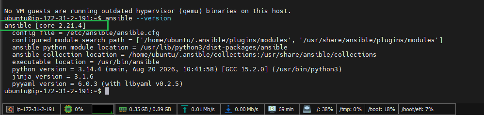
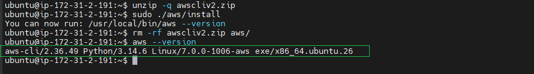
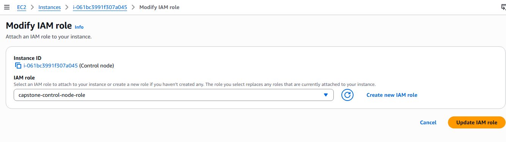
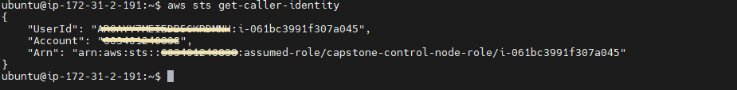

# Secure Enterprise DevOps CI/CD Pipeline for Containerized Applications

An end-to-end DevOps platform on AWS that takes application code from **GitHub**, builds and tests it with **Jenkins**, checks it with **SonarQube** and **Trivy**, stores the image in **Amazon ECR**, and releases it to **Amazon ECS (Fargate)** using a **Blue/Green** strategy — with **Terraform** for infrastructure, **Ansible** for configuration, and **CloudWatch + Grafana** for monitoring.

> **Capstone context:** the original brief used AWS CodeCommit, CodePipeline and CodeBuild. This implementation uses **GitHub** as the source control system and **Jenkins** as the CI/CD engine instead, which is closer to what most teams actually run in production.

---

## Table of Contents

1. [Business Scenario](#1-business-scenario)
2. [What This Project Builds](#2-what-this-project-builds)
3. [Architecture](#3-architecture)
4. [Tech Stack](#4-tech-stack)
5. [Repository Structure](#5-repository-structure)
6. [Prerequisites](#6-prerequisites)
7. [Step 1 — Provision Infrastructure with Terraform](#step-1--provision-infrastructure-with-terraform)
8. [Step 2 — Configure Servers with Ansible](#step-2--configure-servers-with-ansible)
9. [Step 3 — Connect GitHub to Jenkins](#step-3--connect-github-to-jenkins)
10. [Step 4 — The Jenkins Pipeline](#step-4--the-jenkins-pipeline)
11. [Step 5 — DevSecOps: SonarQube + Trivy Security Gates](#step-5--devsecops-sonarqube--trivy-security-gates)
12. [Step 6 — Blue/Green Deployment to ECS](#step-6--bluegreen-deployment-to-ecs)
13. [Step 7 — Monitoring with CloudWatch and Grafana](#step-7--monitoring-with-cloudwatch-and-grafana)
14. [Testing the Rollback](#testing-the-rollback)
15. [Troubleshooting](#troubleshooting)
16. [Cost Notes and Cleanup](#cost-notes-and-cleanup)
17. [What I Learned](#what-i-learned)
18. [Author](#author)

---

## 1. Business Scenario

An e-commerce company has a containerized web application. Today, developers do everything by hand:

- build the application
- run security checks
- build Docker images
- push images to a registry
- deploy the application
- check health and read logs

Every step is manual, slow, and easy to get wrong. One forgotten scan or one bad image goes straight to customers.

**The goal of this project** is to replace that manual process with an automated platform where a single `git push` produces a tested, scanned, versioned image and a zero-downtime release that can roll back on its own.

---

## 2. What This Project Builds

| Area | What gets automated |
|---|---|
| **Infrastructure** | VPC, public/private subnets, NAT, security groups, IAM roles, ALB, ECS cluster, ECR — all in Terraform |
| **CI** | Jenkins builds on every push to `main`, runs unit tests, builds the Docker image |
| **DevSecOps** | SonarQube static analysis with a quality gate; Trivy image scan that fails on HIGH/CRITICAL CVEs |
| **Artifact** | Image tagged with the Git commit SHA and pushed to Amazon ECR |
| **CD** | Blue/Green release to ECS Fargate behind an ALB, with health checks and automatic rollback |
| **Config management** | Ansible installs and configures Jenkins, SonarQube, Grafana, Docker and the AWS CLI |
| **Monitoring** | CloudWatch log groups, container metrics, alarms, SNS notifications, Grafana dashboards |

---

## 3. Architecture



**How the flow works, in plain language:**



1. A developer pushes code to **GitHub**.
2. GitHub fires a **webhook** at the **Jenkins** server running on EC2.
3. Jenkins checks out the code, builds it, and runs unit tests.
4. **SonarQube** scans the source. If the quality gate fails, the pipeline stops here.
5. Jenkins builds a **Docker image** and tags it with the commit SHA.
6. **Trivy** scans that image. If there are HIGH or CRITICAL vulnerabilities, the pipeline stops here.
7. The image is pushed to **Amazon ECR**.
8. Jenkins starts a **Blue/Green deployment** on **Amazon ECS**. A new (green) task set starts alongside the live (blue) one.
9. The **ALB** health-checks the green target group. If it passes, traffic shifts to green. If it fails, CodeDeploy rolls straight back to blue and nobody notices.
10. Logs and metrics land in **CloudWatch**, and **Grafana** visualises them. Alarms notify through **SNS**.

> **Note on Blue/Green:** ECS performs Blue/Green releases through the **CodeDeploy deployment controller**. CodeDeploy here is only the release mechanism for ECS — the *pipeline* itself is entirely Jenkins. Jenkins simply calls `aws deploy create-deployment` with an AppSpec file.

---

## 4. Tech Stack

| Layer | Tool |
|---|---|
| Source control | GitHub |
| CI/CD engine | Jenkins (declarative pipeline, shared credentials) |
| Build | Docker, Maven/npm (depending on the app) |
| Static analysis | SonarQube + Sonar Scanner |
| Image scanning | Trivy |
| Registry | Amazon ECR |
| Compute | Amazon ECS on AWS Fargate |
| Load balancing | Application Load Balancer (two target groups) |
| Release strategy | Blue/Green via CodeDeploy deployment controller |
| Infrastructure as Code | Terraform |
| Configuration management | Ansible |
| Monitoring | Amazon CloudWatch, Grafana, SNS |
| Region | `ap-south-1` (Mumbai) |

---

## 5. Repository Structure

```
.
├── app/                          # Application source + Dockerfile
│   ├── Dockerfile
│   └── src/
├── terraform/
│   ├── main.tf                   # Root module wiring everything together
│   ├── variables.tf
│   ├── outputs.tf
│   ├── backend.tf                # S3 remote state + DynamoDB locking
│   └── modules/
│       ├── vpc/                  # VPC, subnets, IGW, NAT, route tables
│       ├── security/             # Security groups + IAM roles/policies
│       ├── ecr/                  # Container registry
│       ├── alb/                  # ALB, listeners, blue + green target groups
│       ├── ecs/                  # Cluster, task definition, service
│       └── monitoring/           # Log groups, alarms, SNS topic
├── ansible/
│   ├── inventory.ini             # Jenkins / SonarQube / Grafana hosts
│   ├── ansible.cfg
│   ├── playbooks/
│   │   ├── jenkins.yml
│   │   ├── sonarqube.yml
│   │   └── grafana.yml
│   └── roles/
│       ├── common/
│       ├── docker/
│       ├── jenkins/
│       ├── sonarqube/
│       └── grafana/
├── jenkins/
│   └── Jenkinsfile               # The full declarative pipeline
├── deploy/
│   ├── appspec.yaml              # CodeDeploy ECS Blue/Green spec
│   └── taskdef.json              # ECS task definition template
├── docs/
│   └── architecture.png
├── screenshots/                  # Evidence for each stage
└── README.md
```

---

## 6. Prerequisites

### 6.1 AWS account and permissions

- An AWS account with permissions for VPC, EC2, ECS, ECR, IAM, ALB, CodeDeploy, CloudWatch and SNS
- An EC2 key pair in your working region (`ap-south-1`) — download the `.pem` and keep it safe
- A GitHub account and an empty repository for this project

### 6.2 EC2 instances — sizing and storage

You will run this project from an **Ubuntu 24.04 LTS** instance. Here is what each machine needs.

| Role | Instance type | vCPU / RAM | Storage (gp3) | Free Tier? |
|---|---|---|---|---|
| **Control node** (Terraform, Ansible, AWS CLI, Git) | `t3.micro` | 2 / 1 GB | 10 GB | Yes |
| **Jenkins server** (also runs Docker + Trivy) | `t3.medium` | 2 / 4 GB | 20 GB | No |
| **SonarQube server** | `t3.medium` | 2 / 4 GB | 20 GB | No |
| **Grafana server** | `t3.micro` | 2 / 1 GB | 10 GB | Yes (within 750 hrs) |

**Free Tier reality check.** The AWS Free Tier gives you **750 hours/month of `t2.micro` or `t3.micro`** and **30 GB of EBS storage in total**. That covers the control node comfortably, but:

- **Jenkins on `t3.micro` (1 GB RAM) will not work reliably.** Java plus a Docker build will trigger the OOM killer. `t3.small` (2 GB) is the practical minimum; `t3.medium` is what I'd recommend.
- **SonarQube requires 4 GB RAM minimum** (it bundles Elasticsearch, which refuses to start below that). There is no Free Tier option here.
- **30 GB total EBS** is a hard ceiling. The table above adds up to 60 GB, so you will exceed it if all four run at once.

### 6.3 The cheaper approach is below

Run **one `m7i-flex.large` instance with 30 GB gp3** and host Jenkins, SonarQube and Grafana on it as Docker containers, plus a separate free `t3.micro` control node.

```
Control node    → t3.micro,  10 GB  → Terraform + Ansible + AWS CLI   (free)
CI/CD & Tooling → m7i-flex.large, 30 GB  → Jenkins + SonarQube + Grafana   (free)
```

> **Where does the application actually run?** Not on either of these two instances. The application is a container that deploys to **Amazon ECS on AWS Fargate** — a serverless compute layer that Terraform provisions in Step 1. There is no EC2 instance to manage for the app itself; ECS starts, health-checks and replaces its tasks automatically behind the ALB. The two instances above exist purely to build, scan and ship the image — they are your CI/CD toolchain, not the runtime.


Attach an **Elastic IP** to the Jenkins box before configuring the GitHub webhook — otherwise the public IP changes on every stop/start and you'll be re-editing the webhook daily. An Elastic IP is free while attached to a *running* instance, but charged while the instance is stopped, so factor in a few cents.

### 6.4 Security group for the control node and CI/CD tooling box

| Port | Source | Purpose |
|---|---|---|
| 22 | Your IP only (`x.x.x.x/32`) | SSH |
| 8080 | `0.0.0.0/0` | Jenkins UI + GitHub webhook |
| 9000 | Your IP only | SonarQube UI |
| 3000 | Your IP only | Grafana UI |

Never leave 22 open to `0.0.0.0/0`. Bots will find it within minutes.

### 6.5 Launch and connect

```bash
chmod 400 devops-key.pem
ssh -i devops-key.pem ubuntu@<CONTROL_NODE_PUBLIC_IP>
```

Update the box first:

```bash
sudo apt update && sudo apt upgrade -y
sudo apt install -y git curl wget unzip jq software-properties-common gnupg
```



### 6.6 Install Terraform (Ubuntu)

Install from the official HashiCorp APT repository so you get updates with `apt upgrade`:

```bash
# Add HashiCorp's GPG key
wget -O- https://apt.releases.hashicorp.com/gpg | \
  sudo gpg --dearmor -o /usr/share/keyrings/hashicorp-archive-keyring.gpg

# Add the repository for your Ubuntu release
echo "deb [signed-by=/usr/share/keyrings/hashicorp-archive-keyring.gpg] \
https://apt.releases.hashicorp.com $(lsb_release -cs) main" | \
  sudo tee /etc/apt/sources.list.d/hashicorp.list

sudo apt update
sudo apt install -y terraform

terraform version
```



Enable tab-completion (optional but saves a lot of typing):

```bash
terraform -install-autocomplete
source ~/.bashrc
```

### 6.7 Install Ansible (Ubuntu)

```bash
sudo apt install -y software-properties-common
sudo add-apt-repository --yes --update ppa:ansible/ansible
sudo apt install -y ansible

ansible --version
```



### 6.8 Install AWS CLI v2

The `apt` package is v1 and is missing commands this project uses, so install v2 directly:

```bash
curl "https://awscli.amazonaws.com/awscli-exe-linux-x86_64.zip" -o "awscliv2.zip"
unzip -q awscliv2.zip
sudo ./aws/install
rm -rf awscliv2.zip aws/

aws --version
```



**Authentication:** the cleanest option is to attach an **IAM role** to the control node instead of storing keys on disk. Then `aws` works with no `aws configure` at all. If you do use access keys:

**What permissions does that role need?** This is the control node's role — it's the one running `terraform apply`, so it needs to create everything Terraform provisions in Step 1, plus the S3/DynamoDB backend Terraform's state relies on. Fastest path for a personal lab is attaching these AWS managed policies:

| Purpose | AWS managed policy |
|---|---|
| VPC, subnets, IGW, NAT, route tables | `AmazonVPCFullAccess` |
| EC2 instances, security groups, key pairs, ALB | `AmazonEC2FullAccess` |
| ECS cluster, service, task definitions | `AmazonECS_FullAccess` |
| ECR repository, image push/pull | `AmazonEC2ContainerRegistryFullAccess` |
| Blue/Green deployments | `AWSCodeDeployFullAccess` |
| Logs, metrics, alarms, notifications | `CloudWatchFullAccess`, `AmazonSNSFullAccess` |
| IAM roles Terraform creates on your behalf (ECS task role, CodeDeploy role, Jenkins instance profile) | `IAMFullAccess` |
| Terraform remote state (S3 bucket + DynamoDB lock table) | `AmazonS3FullAccess`, `AmazonDynamoDBFullAccess` |

Eight `FullAccess` policies is broad, and fine for a personal lab you'll tear down. For anything longer-lived, replace them with one custom policy scoped to the specific actions Terraform calls (`ec2:*`, `ecs:*`, `ecr:*`, `elasticloadbalancing:*`, `iam:CreateRole`, `iam:PassRole`, `iam:AttachRolePolicy`, `codedeploy:*`, `logs:*`, `cloudwatch:*`, `sns:*`, plus `s3:*`/`dynamodb:*` restricted to just the state bucket and lock table's ARNs).

**Attaching it:**

1. IAM console → **Roles → Create role** → Trusted entity: **AWS service → EC2**
2. Attach the policies above (or your scoped custom one)
3. Name it something like `capstone-control-node-role`
4. EC2 console → select the control node instance → **Actions → Security → Modify IAM role** → attach it

`aws sts get-caller-identity` should now return the role's ARN with no `aws configure` step at all.

> This is a separate, broader role from the one **Jenkins** uses at pipeline runtime. That one — the "Jenkins instance profile" — only needs `ecr:PutImage`/`GetAuthorizationToken`, `ecs:RegisterTaskDefinition`, and `codedeploy:CreateDeployment`, and Terraform creates it for you in Step 1. Don't reuse this control-node role for Jenkins; it's far wider than the pipeline needs.

If you do use access keys instead of a role:

```bash
aws configure
# AWS Access Key ID:     ****
# AWS Secret Access Key: ****
# Default region name:   ap-south-1
# Default output format: json
```





---